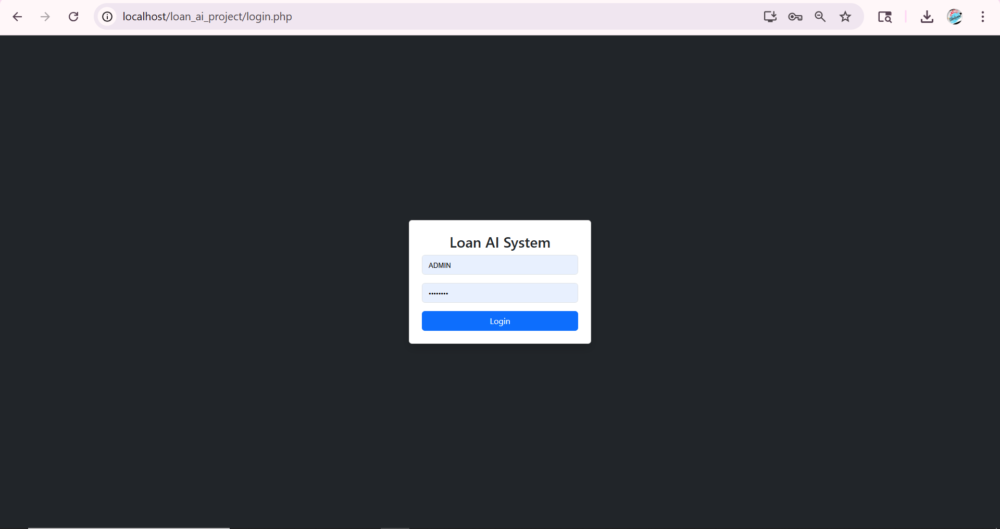
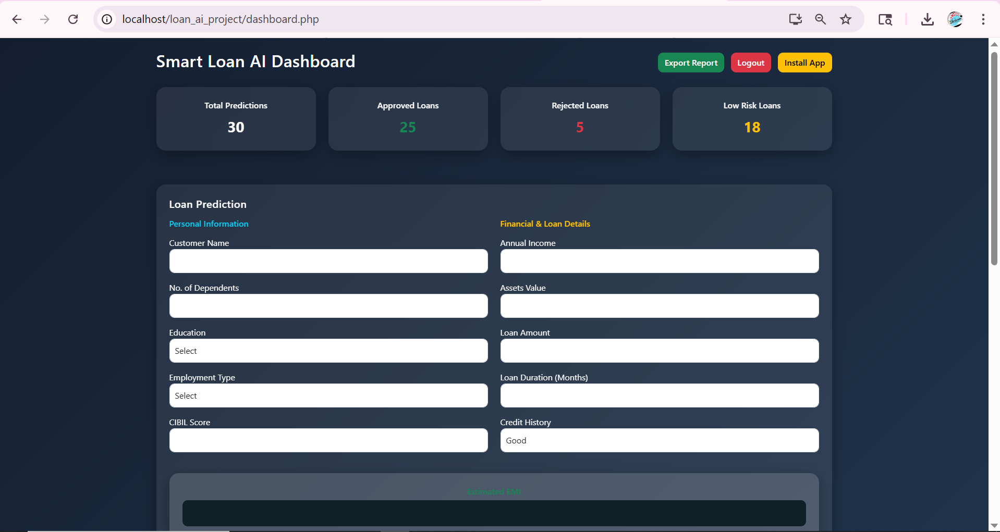
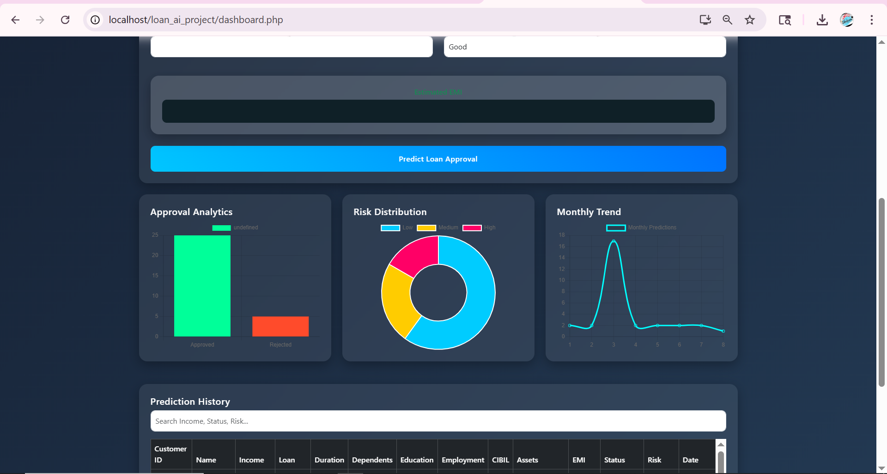
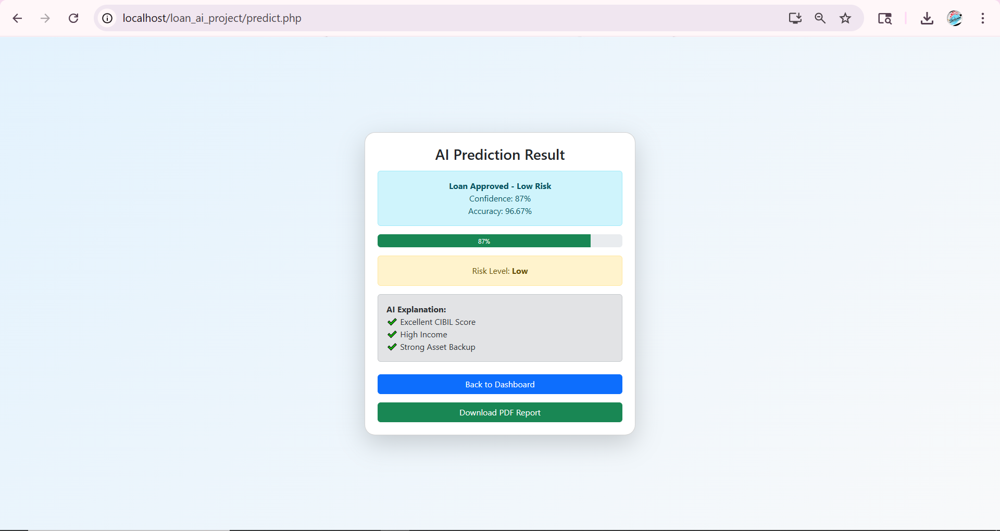
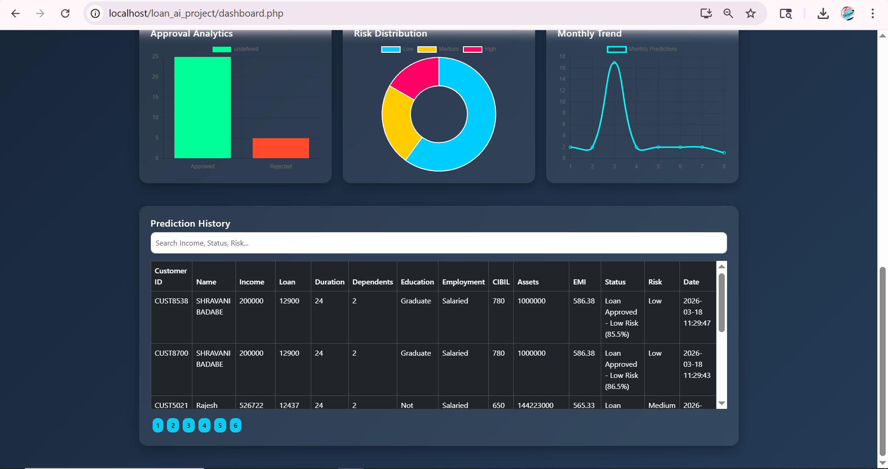
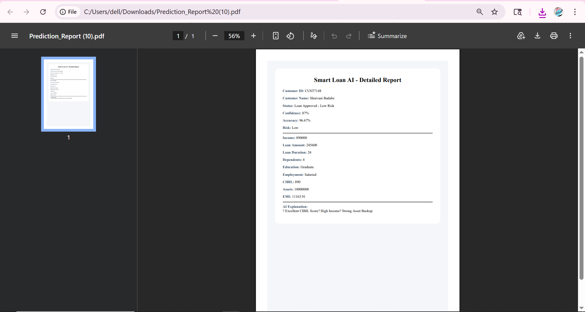

# 📌 Smart Loan Approval System

## 📖 Overview

The Smart Loan Approval System is a web-based application designed to automate the loan approval process using Machine Learning techniques. It analyzes user inputs such as income, loan amount, and credit history to predict whether a loan should be approved or rejected. The system also classifies applicants into different risk levels and presents analytical insights through an interactive dashboard.

---

## 🚀 Features

* 🔹 Loan Approval Prediction using Random Forest  
* 🔹 Risk Level Classification (Low / Medium / High)  
* 🔹 Interactive Dashboard (Charts & Analytics)  
* 🔹 EMI Calculator  
* 🔹 Loan History Tracking  
* 🔹 PDF Report Generation  
* 🔹 CSV Export  
* 🔹 AJAX-based Dynamic Updates  
* 🔹 Progressive Web App (PWA) Support  

---

## 🛠️ Technologies Used

* **Frontend:** HTML, CSS, JavaScript  
* **Backend:** PHP  
* **Machine Learning:** Python (Random Forest)  
* **Database:** MySQL  
* **Visualization:** Chart.js  

---

## ⚙️ System Workflow

1. User enters loan details (income, loan amount, credit history)  
2. Data is sent to the backend (PHP)  
3. Backend communicates with Python ML model  
4. Model predicts loan status and risk level  
5. Results are stored in MySQL database  
6. Output is displayed on dashboard with analytics  

---

## 📊 Output Screenshots

  

### 🔐 Login Page  

### 📊 Dashboard  

### 📈 Loan Prediction Result  

### 📜 Loan History  

### 📄 PDF Report  

---

## 📂 Project Structure
loan_ai_project/
│── dashboard.php
│── login.php
│── logout.php
│── predict.php
│── db.php
│── fetch_history.php
│── export.php
│── export_pdf.php
│── model.py
│── style.css
│── service-worker.js
│── manifest.json
│── icon-192.png
│── icon-512.png
│── loan_ai_project.sql
│── dompdf/
│── images/
│── README.md

---

## ▶️ How to Run

1. Install XAMPP / WAMP  
2. Start Apache & MySQL  
3. Copy project folder to:
   C:/xampp/htdocs/  
4. Import database `loan_ai_project.sql` using phpMyAdmin  
5. Open browser and run:
   http://localhost/loan_ai_project/login.php  

---

## 🎯 Objective

To automate the loan approval process using Machine Learning, reduce manual effort, and improve decision-making through accurate predictions and real-time analytics.

---

## 👩‍💻Developed By

* Shravani Badabe  

---

## 📌 Future Enhancements

* Improve UI/UX design  
* Add advanced machine learning models  
* Implement role-based authentication  
* Deploy system on cloud  

---

## 📄 License

This project is developed for academic purposes.

---
